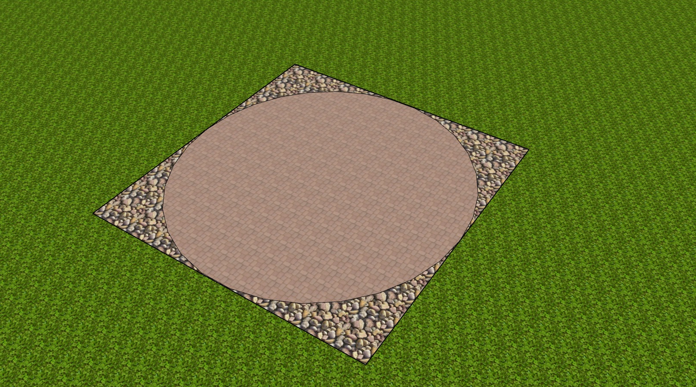

# Monte Carlo Technique
Rand Richards


I have studied a lot of math and it is very seldom that I come across something I had never seen before, but during my intensive study of machine learning and python at Galvanize, I discovered something new - and I am thrilled to share it.

The Monte Carlo Technique for estimating pi, is a very simple process, and can be applied for a variety of computations where the pure math of that calculation is much more difficult that a very good approximation.  The technique is also know my a couple of other interesting titles, such as "The Method of the French Lieutenant".  

The root of the solution is based upon an understanding of probability.  Probability is defined as the number of occurrences of an event divided by the total possible outcomes.  An easy example is assume a fair-coin with heads on one side, and tails on the other.  The probability of flipping a coin and getting heads is the number of head on the coin (1), divided by the total number of sides (2).  So that the probability of getting a head is 1/2, 'P(heads) = # heads / # sides = 1/2'.  Likewise a normal six sides dice has a probability of 1/6 of shaking and getting a 1.


## Imagine a courtyard with a circle inscribed within a square



It is raining :umbrella:, and you are extremely bored so you count rain drops which land in the square courtyard, as well as counting those that fall within the circle.  We can easily replicate this idea with a simple python program:

```
in_circle = 0 # set the beginning number of rain_drops in the circle
total_amount_of_rain = 10**6
# set the number of drops we will count to 10^6, told you we were bored
from random import random
# this will allow us to randomize where our raindrops fall

for count in range(total_amount_of_rain): # start counting
  x, y = random(), random() # the location of our random rain_drops
  # measure distance from our raindrop to center
  # we are really only looking at 1/4 of our courtyard
  # also we are assuming the radius of our circle is 1 unit
  dist = (x**2 + y**2)**(1/2)
  # now we need to see if that raindrop is within our circle
  if dist < 1: # is it within?
    # if it is we add 1 to in_circle count
    in_circle += 1
print("Number of raindrops counted: ", total_amount_of_rain)
print('Number of drops counted with the 1/4 circle is: ', in_circle)
```
The results should look something like this:
```
Number of raindrops counted:  1000000
Number of drops counted with the 1/4 circle is:  785431
```

## It is important to remember that you were really bored

Based on this you can now use the idea of `probability` to ask the question ``"What is the probability that a raindrop will fall within my circle"``


Now what can you do with these numbers???  As you are pondering this you remember that you know something about the area of a circle as compared to the radius.

A <sub> circle </sub> = _&pi;_ r <sup>2</sup>


and you know the area of a square (our square is 2 of the radii on a side)

A <sub> square </sub> = (2r) <sup>2</sup>  = 4 r<sup>2</sup>

When you compare the two you realize that the square is exactly:

<sup>A <sub> circle </sub></sup> / <sub>A <sub> square </sub></sub> = <sup>_&pi;_ r <sup>2</sup></sup> / <sub>4 r<sup>2</sup></sub>  = <sup>_&pi;_</sup> / <sub>4</sub>

From and area point of view then the `probability` of being in the circle when I am in the square is the same as the experiment with the raindrops and can be related to the areas.


# Eureka !!

